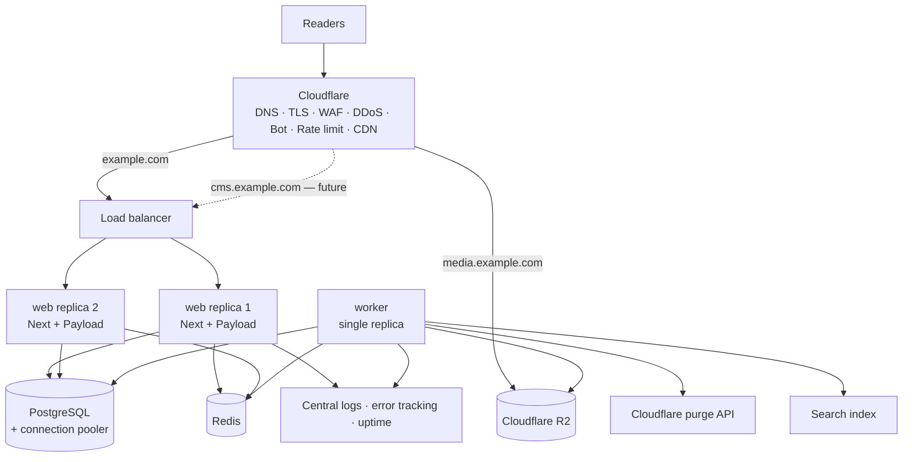
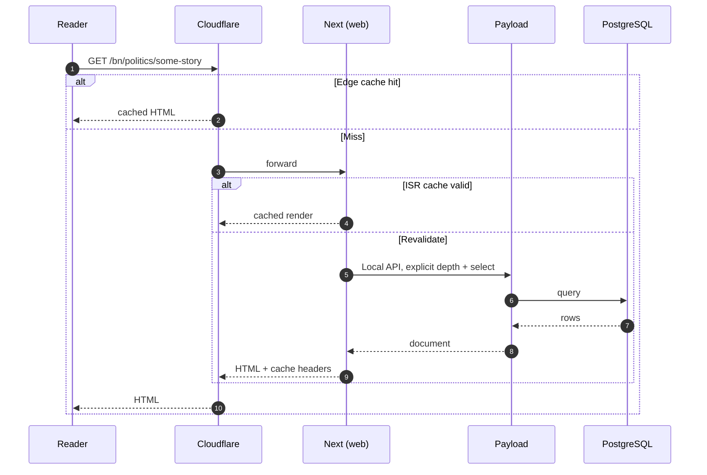
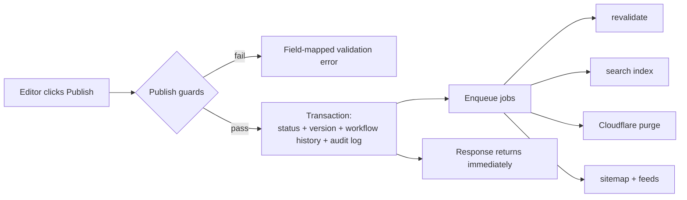

# Architecture

## Goal

One maintainable codebase today, ready to split the public website, the CMS API,
the admin panel and background workers into independently deployable services
without a rewrite.

The seam is enforced by package boundaries rather than by convention:

- `packages/core` imports **neither Payload nor Next**. Access-control rules, the
  article workflow state machine, slug generation, SEO defaults and revalidation
  target calculation live here as pure functions, unit-testable without a
  framework or a database.
- `packages/cms` will be the only place that knows Payload.
- `apps/web` composes them and owns HTTP.

Splitting `/admin` onto `cms.example.com` later means a new app that imports the
same packages — a packaging change, not a refactor.

## System topology

The application runs as **Node processes in containers behind Cloudflare**, not
on Cloudflare Workers. Payload 3 with the PostgreSQL adapter and `sharp` needs a
Node runtime and direct TCP access to the database. Cloudflare provides DNS,
TLS, CDN, WAF, rate limiting and R2 — not application execution.

## Process roles

| Process    | Replicas  | Responsibility                                                                                                |
| ---------- | --------- | ------------------------------------------------------------------------------------------------------------- |
| `web`      | ≥ 2       | Public site, Payload admin, Payload API. Stateless.                                                           |
| `worker`   | exactly 1 | Scheduled publishing, search indexing, cache purge, feeds, sitemaps, image processing, analytics aggregation. |
| `postgres` | managed   | System of record.                                                                                             |
| `redis`    | managed   | Rate limiting, distributed cache.                                                                             |

The worker is separate for two reasons. An editor's Publish request must never
block on third-party I/O, and the job queue must have exactly one runner — N web
replicas polling the same queue would publish the same scheduled article N times.
`JOBS_RUN_IN_PROCESS` is therefore `true` only in the worker container.

## Route groups

`apps/web/src/app` is split into two route groups with separate root layouts:

| Group        | Owns               | Styling           | Cacheability              |
| ------------ | ------------------ | ----------------- | ------------------------- |
| `(frontend)` | Public site        | Tailwind v4       | Cached at the CDN         |
| `(payload)`  | `/admin`, `/api/*` | Payload's own CSS | **Never** publicly cached |

Tailwind's stylesheet is imported _only_ by the frontend layout. Its preflight
reset would otherwise flatten the Payload admin UI. This is the mechanism that
lets the site and the CMS share one deployment safely.

Health endpoints sit outside both groups at `app/api/health` and `app/api/ready`,
so they are not shadowed by Payload's `/api/[...slug]` catch-all.

## Request paths

Anonymous public traffic is served from cache. Authenticated CMS traffic
(`/admin`, `/api/*`) is marked `force-dynamic` and set to bypass at the edge, so
a logged-in editor's response can never be served to an anonymous reader.

## Data flow on publish

Publishing performs no third-party I/O inside the request. The `afterChange`
hook computes revalidation targets with a pure function and enqueues jobs.

A slow Cloudflare API or search cluster can never make the Publish click hang.

## Environment validation

Every process validates its environment at start via `packages/config`. Failure
is immediate and lists all offending keys; values are never echoed. `APP_ENV`
(not `NODE_ENV`) drives the production safety rules — see
[environment.md](environment.md).

## Observability

Structured JSON logs via pino, with a correlation id carried on
`x-correlation-id`. Inbound values are validated before use — an unvalidated
header lands in log files and dashboards, which is a log-injection vector.
Passwords, tokens, cookies and API keys are redacted at the serialiser.

- `/api/health` — liveness. Does **no** I/O; a brief database blip must not
  restart every healthy container.
- `/api/ready` — readiness. Touches the database so the load balancer stops
  routing to an instance that cannot serve real requests. Failure reasons are
  logged, never returned, since the probe is unauthenticated.

## Decisions worth knowing

**Separate `authors` collection.** Public author profiles are distinct from login
accounts, which allows guest bylines and keeps account data out of public JSON.
The relationship to a `user` is optional.

**Live blog updates as their own collection.** Appending to an array field
rewrites the entire document on every update, which does not hold up under live
coverage.

**No Cloudflare Images.** Payload's `sharp` pipeline plus R2 behind the CDN
covers responsive images without a second billing surface and a second URL
scheme. Revisit only if origin transform cost becomes material.

**Cache-tag purge is Enterprise-only.** The purge client's default implementation
enumerates affected URLs and uses single-file purge, which works on every plan.
A tag-based implementation sits behind `CLOUDFLARE_PURGE_BY_TAG`.

**View counts never write to Postgres per request.** Aggregates are synced
periodically by a job; editorial view counts are explicitly eventually
consistent.
