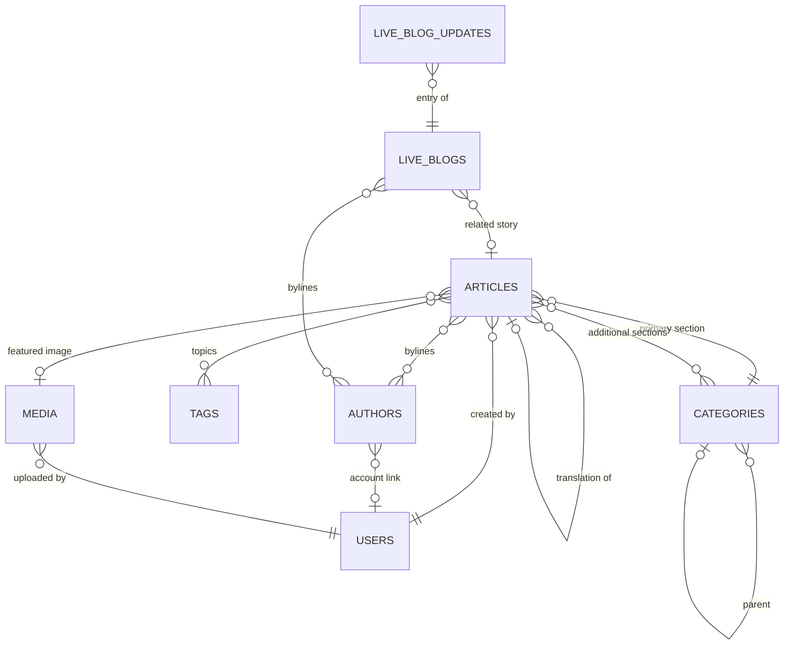

# Content model

## Collections

| Collection          | Purpose                         | Public read    |
| ------------------- | ------------------------------- | -------------- |
| `articles`          | Every story, in ten types       | published only |
| `categories`        | Sections, nested up to 4 levels | yes            |
| `tags`              | Flat topical tags               | yes            |
| `authors`           | Public bylines                  | yes            |
| `media`             | Images, video, audio, documents | yes            |
| `live-blogs`        | Live coverage containers        | live/ended     |
| `live-blog-updates` | Individual timeline entries     | yes            |
| `users`             | CMS accounts                    | no             |

## Articles

Ten types — standard, breaking news, opinion, editorial, feature, interview,
analysis, photo story, video story, live blog — and nine workflow states. The
workflow is documented separately in
[editorial-workflow.md](editorial-workflow.md).

Notable fields beyond the obvious:

| Field                          | Why it exists                                                          |
| ------------------------------ | ---------------------------------------------------------------------- |
| `isBreaking` / `breakingUntil` | Drives the ticker; the flag expires rather than lingering              |
| `translationOf`                | Links a story to the same story written separately in another language |
| `correction`                   | Reader-facing correction notice with its own timestamp                 |
| `workflowHistory`              | Append-only transition log; hook-written only                          |
| `createdBy` / `lastEditedBy`   | Provenance; both refuse field updates                                  |

### Localisation vs translation

Two mechanisms, deliberately, because they answer different questions.

**Localised fields** (Payload localisation) hold parallel `bn` and `en` values in
one document: headline, subheadline, slug, summary, body, correction note and SEO
text. Use this when a story is the same story in two languages. Fallback is on,
so an English route renders Bengali content rather than 404-ing when only Bengali
exists.

**`translationOf`** links two _separate_ article documents. Use this when the
English version is an independently reported adaptation rather than a
translation, with its own byline, length and edit history.

Slugs are localised and unique **per locale** — Payload generates
`UNIQUE (slug, _locale)`, so `dhaka-metro` may exist once in `bn` and once in
`en`. Bengali characters are preserved in slugs rather than transliterated;
zero-width characters are stripped so two slugs cannot look identical while
resolving differently.

## Categories

Nested to a maximum of four levels. A `beforeChange` hook walks up from the
proposed parent and rejects anything that would create a cycle — without it, two
categories can be made each other's parent and every recursive read
(breadcrumbs, navigation, sitemaps) becomes an infinite loop.

`displayOrder` controls navigation position; `isActive` hides a section from
navigation without unpublishing its articles.

## Authors

Separate from `users`, for two reasons: guest contributors and wire bylines need
a public profile without a login account, and a byline is public data while a
user record holds email, roles and session state that must never reach a public
API response.

The optional `user` link connects a profile to an account. **Only someone with
`users:manage` can set it** — otherwise an editor could point their own profile
at an administrator's account.

## Media

Stored in Cloudflare R2 in every environment above development. Nothing is
written to a container's disk in production, and environment validation refuses
to start without R2 credentials when `APP_ENV=production`.

| Control             | Behaviour                                                         |
| ------------------- | ----------------------------------------------------------------- |
| MIME allowlist      | Server-side; `text/html`, `image/svg+xml` and executables refused |
| Size limit          | 50 MB, checked at the transport **and** in a hook                 |
| EXIF                | Stripped by sharp on resize — camera GPS can expose a source      |
| Alt text            | Required for images, and required before use as a featured image  |
| Responsive sizes    | thumbnail, card, feature, wide, og (1200×630)                     |
| `uploadedBy`        | Set on create, refuses updates                                    |
| `usageRestrictions` | Surfaces licensing limits to editors before they place an asset   |

The size check lives in a hook as well as at the transport because the transport
limit only covers HTTP — programmatic uploads from imports, seeds and migrations
would otherwise be unguarded.

## Live blogs

Entries are their own collection, not an array field on the live blog. Appending
to an array rewrites the entire document — every past entry and relationship —
on each new post, which is exactly wrong during live coverage when writes are
most frequent. `(liveBlog, publishedAt)` is indexed so paging a long-running
event stays cheap.

Entries support pinning and a correction flag; `startedAt` and `endedAt` are
stamped from status changes rather than asked of an editor mid-event.

## Shared field builders

| Builder     | Provides                                                                               |
| ----------- | -------------------------------------------------------------------------------------- |
| `slugField` | Auto-generation from a source field, Bengali-safe normalisation, per-locale uniqueness |
| `seoField`  | Optional per-document metadata overrides                                               |

SEO fields are all optional by design: defaults are derived at render time from
the document and the SEO defaults global, so editors only fill them in when they
want to override something. Canonical URLs are validated to be `http`/`https` —
a canonical pointing at `javascript:` would be an injection vector.
