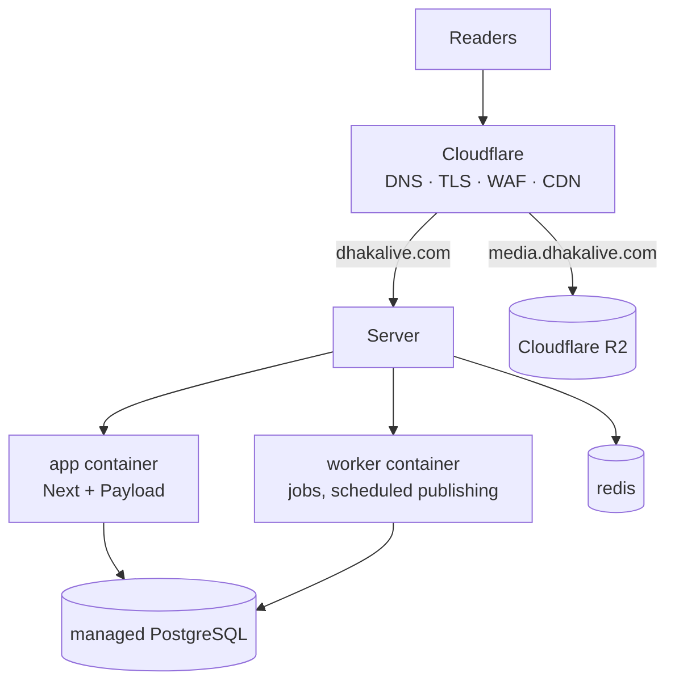

# Deployment

## Shape



The app runs as **Node containers behind Cloudflare**, not on Workers: Payload
with the Postgres adapter and `sharp` needs a Node runtime and a real TCP
connection to the database.

## What runs where

| Component  | Where                  | Notes                                 |
| ---------- | ---------------------- | ------------------------------------- |
| `app`      | Your server, container | Stateless. Scale horizontally.        |
| `worker`   | Your server, container | **Exactly one.** Never scale it.      |
| `redis`    | Your server, container | Ephemeral. No persistence on purpose. |
| PostgreSQL | Separate compose file  | Self-hosted here — see below.         |
| Media      | Cloudflare R2          | Never the container filesystem.       |

### Why the worker is a single replica

Scheduled publishing polls for articles whose time has come. Two runners would
both find the same article and both publish it — duplicate revalidation, duplicate
search indexing, and in the worst case a double-counted correction. The job layer
uses idempotency keys, but the cheap correctness guarantee is one runner.

### Why PostgreSQL has its own compose file

`docker/docker-compose.postgres.yml` is separate, with its own project name and
a named volume. That separation is the point: `docker compose down -v` run
against the **app** stack during an incident cannot reach the database volume.

Self-hosting means you own what a managed provider would do for you:

|                        | Managed   | Self-hosted here                                                |
| ---------------------- | --------- | --------------------------------------------------------------- |
| Backups                | automatic | `scripts/backup-postgres.sh` on cron — **you must set this up** |
| Point-in-time recovery | yes       | no, unless you add WAL archiving                                |
| Survives droplet loss  | yes       | **no** — backups sit on the same disk                           |
| Failover               | yes       | no                                                              |

If the droplet dies, the database and its backups die together. Ship backups off
the box before you carry real editorial content — see [Backups](#backups).

## Sizing

The current droplet is **1 vCPU / 2 GB / 50 GB, Ubuntu 24.04, SGP1**.

Approximate resident memory with all four services running:

| Service     | Idle        | Under load  |
| ----------- | ----------- | ----------- |
| app         | ~250 MB     | 500 MB      |
| worker      | ~180 MB     | 300 MB      |
| postgres    | ~250 MB     | 400 MB      |
| redis       | ~40 MB      | 96 MB       |
| OS + Docker | ~220 MB     | 220 MB      |
| **Total**   | **~940 MB** | **~1.5 GB** |

That leaves real headroom on 2 GB. Two things still hold:

1. **Keep swap.** `server-bootstrap.sh` adds 2 GB. It is the difference between
   a slow minute during a traffic spike and the kernel OOM-killing a process of
   its own choosing — usually the app.
2. Container limits are **caps, not reservations**, so their sum exceeding RAM
   is expected and fine. The defaults suit this box; override for a larger one:

   ```
   APP_MEMORY_LIMIT=1500m
   WORKER_MEMORY_LIMIT=768m
   REDIS_MEMORY_LIMIT=256m
   REDIS_MAXMEMORY=192mb
   POSTGRES_MEMORY_LIMIT=1g
   POSTGRES_SHARED_BUFFERS=512MB
   POSTGRES_EFFECTIVE_CACHE_SIZE=1536MB
   ```

**The single vCPU is now the tighter constraint, not memory.** `sharp` image
processing on upload and Postgres full-text indexing both compete for it, and
both run through the worker. If editors report slow uploads, add a vCPU before
adding RAM.

**Region.** SGP1 is ~50-60 ms from Dhaka. Cloudflare's cache serves readers from
their nearest edge regardless, but every cache miss, admin save and API call pays
this round trip — it is what the newsroom feels all day. The R2 bucket is APAC,
so media and origin are co-located.

## First deployment

### 1. Server prerequisites

One script does all of it — Docker, swap, firewall, deploy user, log rotation,
directory layout. Read it before running it as root:

```bash
curl -fsSL https://raw.githubusercontent.com/msriaj/dhakalive/main/scripts/server-bootstrap.sh -o bootstrap.sh
```

```bash
sudo bash bootstrap.sh
```

It is idempotent, so re-running after a change is safe.

### 2. Environment

Copy `.env.example` to `.env` **on the server** and fill it in. Never commit it.

Production-critical values, all enforced at startup:

```
APP_ENV=production          # not NODE_ENV — see docs/environment.md
DATABASE_SSL=true           # refused if false in production
DATABASE_PUSH=false         # destructive schema push is refused in production
NEXT_PUBLIC_SITE_URL=https://dhakalive.com
```

R2 credentials are mandatory in production; the process will not start without
them. Verify before deploying:

```bash
pnpm verify:r2
```

### 3. Database

Start Postgres first — it is a separate stack:

```bash
docker compose -f docker/docker-compose.postgres.yml up -d
```

Then apply migrations, before the app starts:

```bash
docker compose -f docker/docker-compose.prod.yml run --rm migrate
```

Migrations are committed to the repository and are the only way production
schema changes. `DATABASE_PUSH` is refused when `APP_ENV=production`.

### 4. Start

```bash
docker compose -f docker/docker-compose.prod.yml up -d
```

Then create the first user by visiting `/admin`. That path is open exactly once —
while the users table is empty — and the account is forced to `super-admin`. Do
it immediately after the first deploy, before the site is publicly announced.

### 5. Put Cloudflare in front

See [cloudflare.md](cloudflare.md) for cache rules, WAF, rate limiting and origin
protection. The origin must not be reachable except through Cloudflare.

## Continuous deployment

`.github/workflows/deploy.yml` runs after CI passes on `main`:

1. Build both images, tagged with the **commit SHA** and `latest`.
2. Push to GHCR.
3. SSH to the server, check out that SHA, pull the images.
4. Run migrations — schema first, then the code that expects it.
5. `up -d`, then wait for the container healthcheck.
6. Verify `/api/health` reports the deployed SHA.

Steps 5 and 6 are what stop a broken release from being reported as a success.

### Required GitHub configuration

Repository **variables** (not secret):

| Variable                     | Example                       |
| ---------------------------- | ----------------------------- |
| `NEXT_PUBLIC_SITE_URL`       | `https://dhakalive.com`       |
| `NEXT_PUBLIC_MEDIA_URL`      | `https://media.dhakalive.com` |
| `NEXT_PUBLIC_DEFAULT_LOCALE` | `bn`                          |

Environment **secrets**, under an environment named `production`:

| Secret           | Purpose                   |
| ---------------- | ------------------------- |
| `DEPLOY_HOST`    | Server hostname or IP     |
| `DEPLOY_USER`    | SSH user                  |
| `DEPLOY_SSH_KEY` | Private key for that user |
| `DEPLOY_PORT`    | Optional, defaults to 22  |
| `DEPLOY_PATH`    | e.g. `/srv/dhakalive`     |

Using a GitHub _Environment_ rather than plain repository secrets gives you an
optional approval gate before anything reaches production.

## Rollback

Images are tagged by commit, so rolling back is deploying an older SHA:

```bash
export WEB_IMAGE=ghcr.io/msriaj/dhakalive-web:<previous-sha>
export WORKER_IMAGE=ghcr.io/msriaj/dhakalive-worker:<previous-sha>
docker compose -f docker/docker-compose.prod.yml up -d
```

**Migrations do not roll back automatically.** Write them backward compatible —
add columns, do not rename or drop in the same release that stops using them —
so the previous image keeps working against the newer schema. A destructive
change needs two releases: stop using the column, then remove it.

## Scaling

```bash
docker compose -f docker/docker-compose.prod.yml up -d --scale app=3
```

Remove the fixed host port mapping from `app` first and put a load balancer or
Cloudflare Tunnel in front, or the replicas will fight over port 3000.

Never scale `worker`.

Watch `DATABASE_POOL_MAX`: it is per container. Three app replicas plus a worker
at the default of 10 is 40 connections. Size the database or its pooler to match.

## Health and observability

| Endpoint      | Meaning                                                                                              |
| ------------- | ---------------------------------------------------------------------------------------------------- |
| `/api/health` | Liveness. Does no I/O — a database blip must not restart every container.                            |
| `/api/ready`  | Readiness. Checks the database, so the load balancer stops routing to an instance that cannot serve. |

`/api/health` reports the deployed version, which is what the deploy workflow
checks. Logs are structured JSON with correlation IDs; passwords, tokens and
cookies are redacted at the serialiser.

## Backups

The database is the only thing that cannot be rebuilt. Media lives in R2, and
both images are reproducible from a commit.

Self-hosted Postgres has no automated backups. Set this up on day one:

```bash
crontab -e -u deploy
```

```
15 2 * * * cd /srv/dhakalive && ./scripts/backup-postgres.sh >> /var/log/dhakalive-backup.log 2>&1
```

The script dumps in custom format, **verifies the archive is readable** with
`pg_restore --list`, then prunes anything older than 14 days — pruning only
after verification, so a failed backup never takes the last good one with it.

### Get them off the box

A backup on the same droplet protects against a bad migration or a dropped
table. It does not protect against losing the droplet. Sync to R2 nightly:

```bash
rclone sync docker/postgres/backups r2:dhakalive-backups
```

Use a **separate bucket** from media, with a token scoped to it.

### Restore

```bash
docker compose -f docker/docker-compose.postgres.yml exec -T postgres \
  pg_restore -U dhakalive -d dhakalive --clean --if-exists /backups/<file>.dump
```

Stop the app and worker first, or they will write into a half-restored schema.

**Rehearse this.** An untested backup is not a backup — restore into a throwaway
database and check an article renders before you need it at 3am.

### Media

R2 has no automatic versioning; enable it if you want protection against a bad
bulk media operation.
