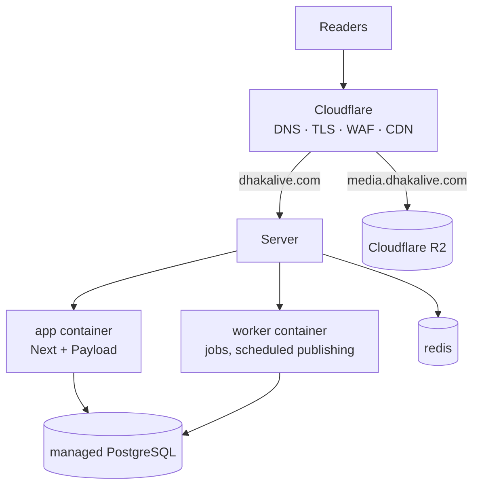

# Deployment

## Shape



The app runs as **Node containers behind Cloudflare**, not on Workers: Payload
with the Postgres adapter and `sharp` needs a Node runtime and a real TCP
connection to the database.

## What runs where

| Component  | Where                  | Notes                                     |
| ---------- | ---------------------- | ----------------------------------------- |
| `app`      | Your server, container | Stateless. Scale horizontally.            |
| `worker`   | Your server, container | **Exactly one.** Never scale it.          |
| `redis`    | Your server, container | Ephemeral. No persistence on purpose.     |
| PostgreSQL | **Managed service**    | Backups, PITR and failover are the point. |
| Media      | Cloudflare R2          | Never the container filesystem.           |

### Why the worker is a single replica

Scheduled publishing polls for articles whose time has come. Two runners would
both find the same article and both publish it — duplicate revalidation, duplicate
search indexing, and in the worst case a double-counted correction. The job layer
uses idempotency keys, but the cheap correctness guarantee is one runner.

### Why PostgreSQL is not in the compose file

A database container on the app server has no automated backups, no
point-in-time recovery, and dies with the box. `docker compose down -v` during a
3am incident would delete the newspaper. Use a managed provider (Neon, RDS,
Supabase, DigitalOcean). If you self-host it anyway, run it from a separate
compose file with its own volume and a tested restore procedure.

## First deployment

### 1. Server prerequisites

- Docker Engine with the Compose plugin
- A non-root user in the `docker` group
- The repository cloned to a stable path, e.g. `/srv/dhakalive`

### 2. Environment

Copy `.env.example` to `.env` **on the server** and fill it in. Never commit it.

Production-critical values, all enforced at startup:

```
APP_ENV=production          # not NODE_ENV — see docs/environment.md
DATABASE_SSL=true           # refused if false in production
DATABASE_PUSH=false         # destructive schema push is refused in production
NEXT_PUBLIC_SITE_URL=https://dhakalive.com
```

R2 credentials are mandatory in production; the process will not start without
them. Verify before deploying:

```bash
pnpm verify:r2
```

### 3. Database

```bash
docker compose -f docker/docker-compose.prod.yml run --rm migrate
```

Migrations are committed to the repository and are the only way production
schema changes. `DATABASE_PUSH` is refused when `APP_ENV=production`.

### 4. Start

```bash
docker compose -f docker/docker-compose.prod.yml up -d
```

Then create the first user by visiting `/admin`. That path is open exactly once —
while the users table is empty — and the account is forced to `super-admin`. Do
it immediately after the first deploy, before the site is publicly announced.

### 5. Put Cloudflare in front

See [cloudflare.md](cloudflare.md) for cache rules, WAF, rate limiting and origin
protection. The origin must not be reachable except through Cloudflare.

## Continuous deployment

`.github/workflows/deploy.yml` runs after CI passes on `main`:

1. Build both images, tagged with the **commit SHA** and `latest`.
2. Push to GHCR.
3. SSH to the server, check out that SHA, pull the images.
4. Run migrations — schema first, then the code that expects it.
5. `up -d`, then wait for the container healthcheck.
6. Verify `/api/health` reports the deployed SHA.

Steps 5 and 6 are what stop a broken release from being reported as a success.

### Required GitHub configuration

Repository **variables** (not secret):

| Variable                     | Example                       |
| ---------------------------- | ----------------------------- |
| `NEXT_PUBLIC_SITE_URL`       | `https://dhakalive.com`       |
| `NEXT_PUBLIC_MEDIA_URL`      | `https://media.dhakalive.com` |
| `NEXT_PUBLIC_DEFAULT_LOCALE` | `bn`                          |

Environment **secrets**, under an environment named `production`:

| Secret           | Purpose                   |
| ---------------- | ------------------------- |
| `DEPLOY_HOST`    | Server hostname or IP     |
| `DEPLOY_USER`    | SSH user                  |
| `DEPLOY_SSH_KEY` | Private key for that user |
| `DEPLOY_PORT`    | Optional, defaults to 22  |
| `DEPLOY_PATH`    | e.g. `/srv/dhakalive`     |

Using a GitHub _Environment_ rather than plain repository secrets gives you an
optional approval gate before anything reaches production.

## Rollback

Images are tagged by commit, so rolling back is deploying an older SHA:

```bash
export WEB_IMAGE=ghcr.io/msriaj/dhakalive-web:<previous-sha>
export WORKER_IMAGE=ghcr.io/msriaj/dhakalive-worker:<previous-sha>
docker compose -f docker/docker-compose.prod.yml up -d
```

**Migrations do not roll back automatically.** Write them backward compatible —
add columns, do not rename or drop in the same release that stops using them —
so the previous image keeps working against the newer schema. A destructive
change needs two releases: stop using the column, then remove it.

## Scaling

```bash
docker compose -f docker/docker-compose.prod.yml up -d --scale app=3
```

Remove the fixed host port mapping from `app` first and put a load balancer or
Cloudflare Tunnel in front, or the replicas will fight over port 3000.

Never scale `worker`.

Watch `DATABASE_POOL_MAX`: it is per container. Three app replicas plus a worker
at the default of 10 is 40 connections. Size the database or its pooler to match.

## Health and observability

| Endpoint      | Meaning                                                                                              |
| ------------- | ---------------------------------------------------------------------------------------------------- |
| `/api/health` | Liveness. Does no I/O — a database blip must not restart every container.                            |
| `/api/ready`  | Readiness. Checks the database, so the load balancer stops routing to an instance that cannot serve. |

`/api/health` reports the deployed version, which is what the deploy workflow
checks. Logs are structured JSON with correlation IDs; passwords, tokens and
cookies are redacted at the serialiser.

## Backups

The database is the only thing that cannot be rebuilt. Media lives in R2, and
both images are reproducible from a commit.

- Enable automated daily backups and PITR on the managed database.
- **Rehearse a restore.** An untested backup is not a backup.
- R2 has no automatic versioning; enable it if you want protection against a
  bad bulk media operation.
