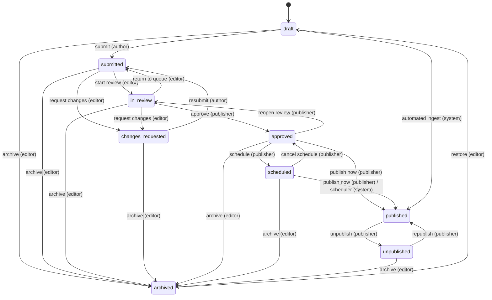

# Editorial workflow

## The state machine



The workflow is **data**, not code:
[`packages/core/src/workflow/transitions.ts`](../packages/core/src/workflow/transitions.ts)
declares every legal edge as a row with its required capability. A status change
that is not in the table is rejected, so a crafted request setting
`workflowStatus: "published"` on a draft is a validation error rather than an
unnoticed state change. Adding a workflow step is a table edit.

## Rules worth knowing

**Articles always start as drafts.** A create request asking for any other status
is refused, whatever the actor's role.

**Authors submit only their own work.** `draft → submitted` is owner-only.
Editors can submit anything, because they can already edit anything.

**Editors review; publishers publish.** An editor can start a review, request
changes and archive, but cannot approve or publish. That separation is the
point of the model.

**Published cannot be archived directly.** It must be unpublished first, so cache
purging and search de-indexing run through the normal unpublish path.

**Restoring goes back to draft**, not to the status the article held when it was
archived — otherwise a story could re-enter the pipeline past its review step.

**Republishing keeps the original `publishedAt`**, so a corrected story does not
jump back to the top of every feed.

**`draft → published` exists, but only for the machine.** The automated ingest
takes it as a `systemOnly` transition, the same mechanism the scheduler uses, so
it is unreachable from an HTTP body and no role can take it — a publisher asking
for it is refused. It is one edge rather than a walk through submit, review and
approve because those four transitions each assert something in the audit trail:
"an editor reviewed this" is a claim, and a machine taking that path would write
it falsely. The publish guards run exactly as they do for a person, so an
ingested story missing an image, a category or alt text stays a draft.

## Publish guards

Moving to `published` or `scheduled` requires the article to be complete.
Everything is checked at once and each failure is mapped to its field, so the
editor sees what is missing rather than a generic error.

| Requirement      | Note                                                       |
| ---------------- | ---------------------------------------------------------- |
| Headline         | Non-empty                                                  |
| Slug             | Non-empty and valid                                        |
| Body             | Real content — an empty Lexical state is not a filled body |
| Authors          | At least one                                               |
| Primary category | Required; also determines the URL                          |
| Language         | The locale being published                                 |
| Featured image   | Required, **and it must already have alt text**            |

The featured image is resolved with one targeted lookup rather than raising the
collection's relationship depth — the alt-text rule is the whole reason it needs
resolving.

Live blogs are exempt from the featured-image requirement: they lead with their
timeline, not a hero image.

Scheduling additionally requires `scheduledAt` to be set and in the future.

## Who can do what

| Action                   | contributor | reporter | editor | publisher |
| ------------------------ | :---------: | :------: | :----: | :-------: |
| Create a draft           |      ✓      |    ✓     |   ✓    |     ✓     |
| Edit own unpublished     |      ✓      |    ✓     |   ✓    |     ✓     |
| Edit anyone's            |      —      |    —     |   ✓    |     ✓     |
| Submit own               |      ✓      |    ✓     |   ✓    |     ✓     |
| Review / request changes |      —      |    —     |   ✓    |     ✓     |
| Approve                  |      —      |    —     |   —    |     ✓     |
| Schedule                 |      —      |    —     |   —    |     ✓     |
| Publish / unpublish      |      —      |    —     |   —    |     ✓     |
| Archive / restore        |      —      |    —     |   ✓    |     ✓     |
| Delete own draft         |      —      |    ✓     |   ✓    |     ✓     |
| Delete anyone's          |      —      |    —     |   —    |     —     |

Hard deletion of any article is `admin` and above — see
[roles-and-permissions.md](roles-and-permissions.md).

## Draft isolation

A reporter cannot read, edit or submit another reporter's draft. That is enforced
by a `Where` constraint returned from the access callback, which Payload compiles
into SQL — so it holds on REST, GraphQL, the Local API and the admin list view
alike. A UI-level filter would leave a direct API call wide open.

Anonymous readers see `workflowStatus = published` and nothing else.

## Audit trail

Every accepted transition appends to `workflowHistory`:

```json
{
  "from": "in-review",
  "to": "approved",
  "at": "…",
  "actor": 7,
  "note": "Legal cleared"
}
```

The field is written only by the workflow hook — field-level access refuses
create and update, because an editable audit trail is not one. The `workflowNote`
an editor types is moved onto the transition record and cleared from the
document, so notes belong to the decision rather than to the article.

## Two kinds of status

| Field            | Owner   | Values                    | Purpose                           |
| ---------------- | ------- | ------------------------- | --------------------------------- |
| `workflowStatus` | Us      | The nine editorial states | The editorial process             |
| `_status`        | Payload | `draft` \| `published`    | Drafts, autosave, version history |

`_status` is **derived** from `workflowStatus` in the hook, never set
independently. That gives defence in depth: a query that forgets to filter on
`workflowStatus` still will not return a non-published article, because Payload
excludes drafts by default.

> The editorial field is named `workflowStatus` rather than `status` for a
> concrete reason. With versions enabled, a sibling field called `status`
> collides with Payload's reserved `_status` when Postgres enum names are
> generated for the versions table, and every editorial value beyond
> `draft`/`published` is then rejected at the database level.

## Testing

| Layer       | Location                                              | Covers                                     |
| ----------- | ----------------------------------------------------- | ------------------------------------------ |
| Unit        | `packages/core/src/workflow/*.test.ts`                | Table integrity, reachability, permissions |
| Integration | `apps/web/tests/integration/article-workflow.test.ts` | The workflow as Payload applies it         |

The unit suite asserts structural properties, not just examples: every status is
reachable from `draft`, nothing except `archived` is a dead end, and no
system-only transition is ever offered to a user.
